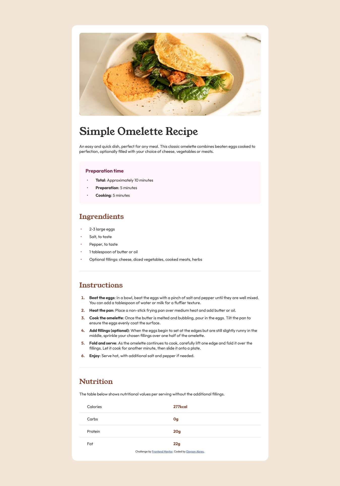

# Frontend Mentor - Recipe page solution

This is a solution to the [Recipe page challenge on Frontend Mentor](https://www.frontendmentor.io/challenges/recipe-page-KiTsR8QQKm). Frontend Mentor challenges help you improve your coding skills by building realistic projects. 

## Table of contents

- [Overview](#overview)
  - [Screenshot](#screenshot)
- [My process](#my-process)
  - [Built with](#built-with)
  - [What I learned](#what-i-learned)
  - [Continued development](#continued-development)
  - [Useful resources](#useful-resources)
- [Author](#author)

## Overview

### Screenshot

## My process

### Built with

- Semantic HTML5 markup
- CSS custom properties
- Desktop-first workflow

### What I learned

Using `@font-face` to request fonts from your own directory is very convenient. It's better than installing them on the OS.

### Continued development

I still need to understand the influence of `border-collapse` on the configurations of a `<table>`.

### Useful resources

- [DigitalOcean](https://www.digitalocean.com/community/tutorials/how-to-load-and-use-custom-fonts-with-css) - Here I was able to learn about the most varied ways of loading a font, especially with `@font-face`.

- [MDN Web Docs](https://developer.mozilla.org/pt-BR/docs/Web/HTML/Element/hr) - Using `
` instead of a `

` is probably better.

- [Stack Overflow](https://stackoverflow.com/a/29166036) - It is possible to center `<body>` using `margin: auto`.

## Author

- Frontend Mentor - [@ElaysonAbreu](https://www.frontendmentor.io/profile/elaysonabreu)
